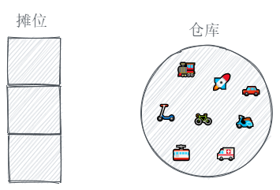
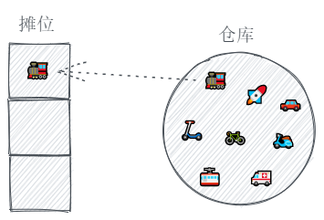
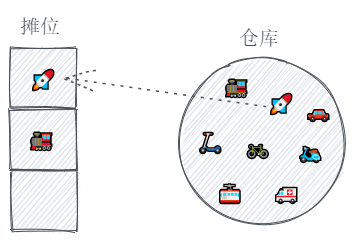
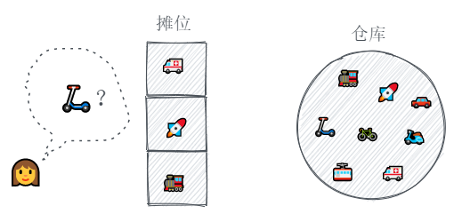
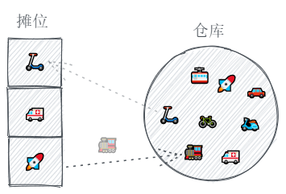
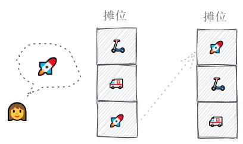

# 题目

https://leetcode-cn.com/problems/lru-cache/submissions/

## 题目描述

```
运用你所掌握的数据结构，设计和实现一个  LRU (最近最少使用) 缓存机制。它应该支持以下操作： 获取数据 get 和 写入数据 put 。

获取数据 get(key) - 如果关键字 (key) 存在于缓存中，则获取关键字的值（总是正数），否则返回 -1。
写入数据 put(key, value) - 如果关键字已经存在，则变更其数据值；如果关键字不存在，则插入该组「关键字/值」。当缓存容量达到上限时，它应该在写入新数据之前删除最久未使用的数据值，从而为新的数据值留出空间。

进阶:

你是否可以在 O(1) 时间复杂度内完成这两种操作？

示例:

LRUCache cache = new LRUCache( 2 /* 缓存容量 */ );

cache.put(1, 1);
cache.put(2, 2);
cache.get(1);       // 返回  1
cache.put(3, 3);    // 该操作会使得关键字 2 作废
cache.get(2);       // 返回 -1 (未找到)
cache.put(4, 4);    // 该操作会使得关键字 1 作废
cache.get(1);       // 返回 -1 (未找到)
cache.get(3);       // 返回  3
cache.get(4);       // 返回  4

来源：力扣（LeetCode）
链接：https://leetcode-cn.com/problems/lru-cache
著作权归领扣网络所有。商业转载请联系官方授权，非商业转载请注明出处。
```

# 我的回答

## 思路

假设我们有一个玩具摊位，可以向顾客展示小玩具，但是摊位大小有限，我们不能把所有的玩具都摆在摊位上，所以我们就把大部分的玩具都放在了仓库里。



如果有顾客来问，我们就去仓库把那个玩具拿出来，摆在摊位上。



因为最上面的那个位置最显眼，所以我们想总是把最新拿出来的玩具放在那。



但是摊位大小有限，很快就摆满了，如果这时又来了顾客想看新玩具。



我们只能把最下面的玩具拿回仓库(因为最下面的位置相对没那么受欢迎)，腾出一个位置来放新玩具。



如果顾客想看的玩具就在摊位上，我们就可以直接展示这个玩具，同时把它放到最上面的位置(有人问说明它受欢迎嘛)，其他的玩具就要挪挪位置了。



回到计算机问题上面来，我们要用什么来表示我们的玩具摊位呢，如果用数组，玩具在摊位上的位置挪来挪去的，时间复杂度得是 O(N)，所以只能用链表了。

用链表的话，随意移除一个节点的时间复杂度是 O(1)，移除节点后，我们还得把它前后两个节点连起来，所以用双向链表会比较方便。

但是链表获取节点的时间复杂度是 O(N)，我们手动移动玩具的时候，只需要看一眼就知道要找的玩具在哪个位置上，但是计算机没有那么聪明，所以我们还需要一个数据结构(哈希表)来帮计算机记录什么玩具在什么位置上。

## 复杂度分析

- 时间复杂度：O(1)。
- 空间复杂度：链表 O(N)，哈希表 O(N)，结果还是 O(N)。

## 伪代码

```
// put

if key 存在:
  更新节点值
  把节点移到链表头部

else:
  if 缓存满了:
    移除最后一个节点
    删除它在哈希表中的映射

  新建一个节点
  在哈希表中增加映射
  把节点加到链表头部


// get

if key 存在:
  返回节点值
  把节点移到链表头部
else:
  返回 -1
```

## 代码

JavaScript Code

```js
class DoubleLinkedListNode {
  constructor(key, value) {
    this.key = key
    this.value = value
    this.prev = null
    this.next = null
  }
}

class LRUCache {
  constructor(capacity) {
    this.capacity = capacity
    // Mappings of key->node.
    this.hashmap = {}
    // Use two dummy nodes so that we don't have to deal with the head/tail seperately.
    this.dummyHead = new DoubleLinkedListNode(null, null)
    this.dummyTail = new DoubleLinkedListNode(null, null)
    this.dummyHead.next = this.dummyTail
    this.dummyTail.prev = this.dummyHead
  }

  _isFull() {
    return Object.keys(this.hashmap).length === this.capacity
  }

  _removeNode(node) {
    node.prev.next = node.next
    node.next.prev = node.prev
    node.prev = null
    node.next = null
    return node
  }

  _addToHead(node) {
    const head = this.dummyHead.next
    node.next = head
    head.prev = node
    node.prev = this.dummyHead
    this.dummyHead.next = node
  }

  get(key) {
    if (key in this.hashmap) {
      const node = this.hashmap[key]
      this._addToHead(this._removeNode(node))
      return node.value
    } else {
      return -1
    }
  }

  put(key, value) {
    if (key in this.hashmap) {
      // If key exists, update the corresponding node and move it to the head.
      const node = this.hashmap[key]
      node.value = value
      this._addToHead(this._removeNode(node))
    } else {
      // If it's a new key.
      if (this._isFull()) {
        // If the cache is full, remove the tail node.
        const node = this.dummyTail.prev
        delete this.hashmap[node.key]
        this._removeNode(node)
      }
      // Create a new node and add it to the head.
      const node = new DoubleLinkedListNode(key, value)
      this.hashmap[key] = node
      this._addToHead(node)
    }
  }
}

/**
 * Your LRUCache object will be instantiated and called as such:
 * var obj = new LRUCache(capacity)
 * var param_1 = obj.get(key)
 * obj.put(key,value)
 */
```

# 参考回答

https://leetcode-cn.com/problems/lru-cache/solution/shuang-lian-biao-ha-xi-biao-by-zstar01/