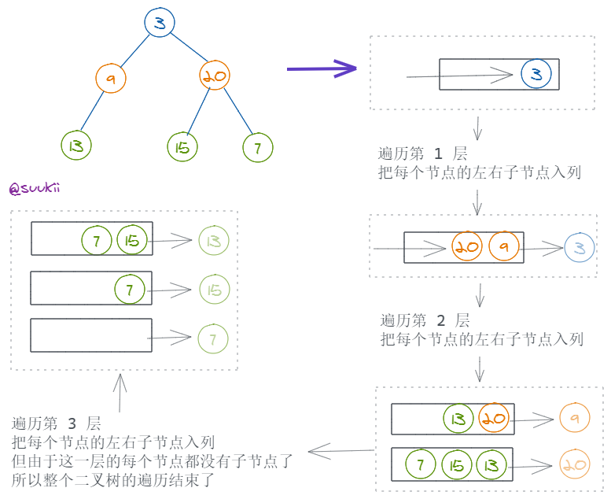

# 104.二叉树的最大深度

https://leetcode-cn.com/problems/maximum-depth-of-binary-tree/

## 题目描述

```
给定一个二叉树，找出其最大深度。

二叉树的深度为根节点到最远叶子节点的最长路径上的节点数。

说明: 叶子节点是指没有子节点的节点。

示例：
给定二叉树 [3,9,20,null,null,15,7]，

    3
   / \
  9  20
    /  \
   15   7
返回它的最大深度 3 。

来源：力扣（LeetCode）
链接：https://leetcode-cn.com/problems/maximum-depth-of-binary-tree
著作权归领扣网络所有。商业转载请联系官方授权，非商业转载请注明出处。
```


# 我的回答

## 方法1：递归

### 思路

递归地分别计算出左子树和右子树的高度，取最大值加一，就是当前二叉树的最大深度。


假设我们已经计算出了左子树的最大深度是 1，右子树的最大深度是 2，那整棵二叉树的的最大深度就是左右子树最大深度的最大值加上根节点，也就是 3。

接下来我们只需要递归地去计算左右子树的高度：

1. base condition: 首先在递归中很重要的事情就是找到递归的出口，在这道题目中，明显能想到的一个出口是，当遍历到叶子节点的时候：`if not root.left and not root.right`，这时候我们需要 `return 1`，还有一种情况是，当前遍历的节点为 `null`，这时候我们只需要 `return 0` 就好了。

2. 如果当前节点有左子树，递归计算左子树的高度 `leftHeight = maxDepth(root.left)`

2. 如果当前节点有右子树，递归计算右子树的高度 `rightHeight = maxDepth(root.right)`

3. 取左右子树最大高度的最大值，加上当前节点返回 `max(leftHeight, rightHeight) + 1`

### 复杂度分析

- 时间复杂度：O(N)，因为每个节点都只遍历一次。
- 空间复杂度：如果考虑递归调用函数占用的调用栈空间的话，空间复杂度应该是 O(N)，不考虑的话就是 O(1)，因为没有用到额外的空间。

### 代码

JavaScript Code
```js
/**
 * Definition for a binary tree node.
 * function TreeNode(val) {
 *     this.val = val;
 *     this.left = this.right = null;
 * }
 */
/**
 * @param {TreeNode} root
 * @return {number}
 */
var maxDepth = function(root) {
    if (!root) return 0
    return Math.max(maxDepth(root.left), maxDepth(root.right)) + 1
};
```

Python Code
```py
# Definition for a binary tree node.
# class TreeNode(object):
#     def __init__(self, x):
#         self.val = x
#         self.left = None
#         self.right = None

class Solution(object):
    def maxDepth(self, root):
        """
        :type root: TreeNode
        :rtype: int
        """
        if not root: return 0
        return max(self.maxDepth(root.left), self.maxDepth(root.right)) + 1
```

## 方法2：循环+栈

### 思路

我们还可以用层级遍历的方法来找到二叉树的最大高度，一层层地遍历二叉树，每遍历一层，`height` 加一。

1. 记录当前这一层有多少个节点 `nodeCount`，当 `nodeCount` 等于 0 的时候，当前层遍历结束，`height++`，继续遍历下一层；
2. 当下一层的节点数为 0 的时候，停止遍历，返回 `height`；



### 复杂度分析

- 时间复杂度：O(N)，因为每个节点都分别入列出列一次，入列和出列操作的时间复杂度都是 O(1)，所以总的时间复杂度是 O(2N)，也就是 O(N)。
- 空间复杂度：O(logN)，队列的最大长度，最坏的情况就是二叉树是完全二叉树，遍历到最后一层的时候，节点数是 (2^N)。

### 伪代码

```
新建一个队列来存放遍历的节点
把 root 推入队列
初始化 height 为 0

重复以下步骤：
  记录当前层级的节点数 nodeCount (即队列中的节点数)

  if nodeCount === 0: return height // 二叉树遍历结束

  // 遍历当前层级的每个节点
  while nodeCount > 0:
    出列一个节点，将它的左右子节点入列
    nodeCount--
  // 当前层级遍历结束，此时队列中的是下一层的节点
```

### 代码

JavaScript Code
```js
/**
 * Definition for a binary tree node.
 * function TreeNode(val) {
 *     this.val = val;
 *     this.left = this.right = null;
 * }
 */
/**
 * @param {TreeNode} root
 * @return {number}
 */
var maxDepth = function(root) {
    const queue = []
    root && queue.push(root)
    let height = 0

    while (true) {
        let nodeCount = queue.length
        if (nodeCount === 0) return height
        height++

        while (nodeCount > 0) {
            const node = queue.shift()
            node.left && queue.push(node.left)
            node.right && queue.push(node.right)
            nodeCount--
        } 
    }
};
```

Python Code
```py
# Definition for a binary tree node.
# class TreeNode(object):
#     def __init__(self, x):
#         self.val = x
#         self.left = None
#         self.right = None

class Solution(object):
    def maxDepth(self, root):
        """
        :type root: TreeNode
        :rtype: int
        """
        queue = []
        if root is not None: queue.append(root)
        height = 0

        while True:
            nodeCount = len(queue)
            if nodeCount == 0: return height
            height += 1

            while nodeCount > 0:
                node = queue.pop(0)
                if node.left is not None: queue.append(node.left)
                if node.right is not None: queue.append(node.right)
                nodeCount -= 1
```

_Originally posted by @suukii in https://github.com/leetcode-pp/91alg-1/issues/32#issuecomment-643574983_


# 参考回答