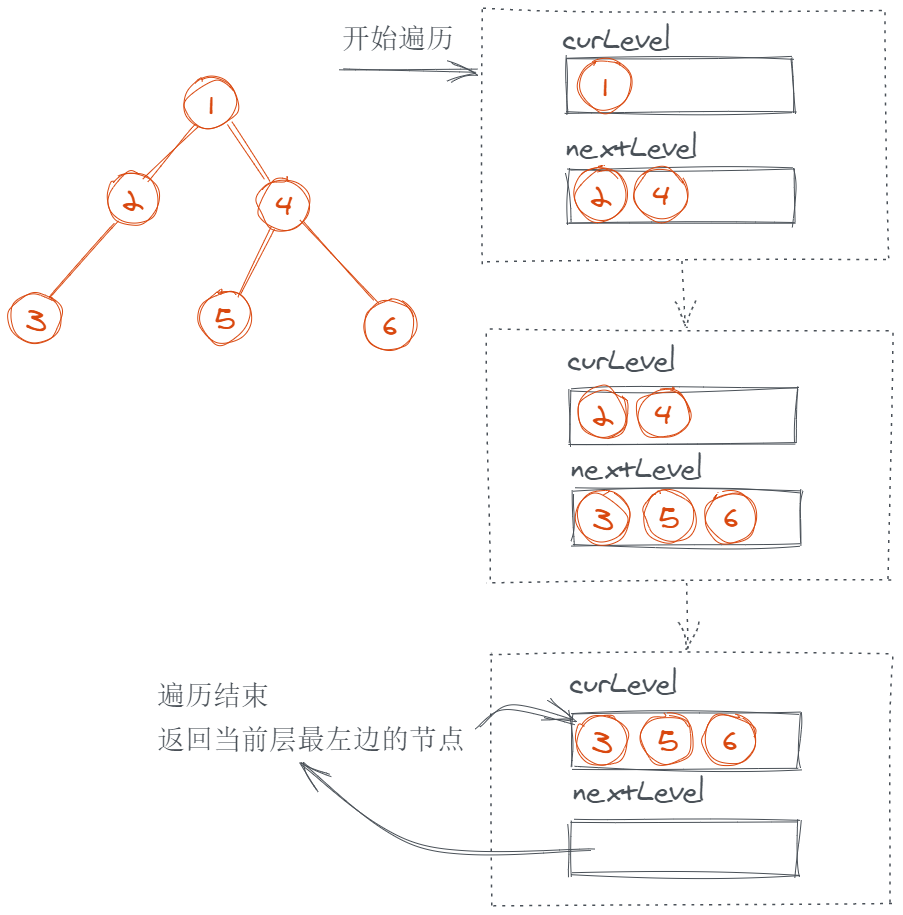

# 513.找树左下角的值

https://leetcode-cn.com/problems/find-bottom-left-tree-value/submissions/

## 题目描述

```
给定一个二叉树，在树的最后一行找到最左边的值。

示例 1:

输入:

    2
   / \
  1   3

输出:
1
 

示例 2:

输入:

        1
       / \
      2   3
     /   / \
    4   5   6
       /
      7

输出:
7
 

注意: 您可以假设树（即给定的根节点）不为 NULL。

来源：力扣（LeetCode）
链接：https://leetcode-cn.com/problems/find-bottom-left-tree-value
著作权归领扣网络所有。商业转载请联系官方授权，非商业转载请注明出处。
```


# 我的回答

## 方法1：BFS

### 思路

一层层地遍历二叉树，遍历到最后一层的时候，返回第一个节点。



### 伪代码

```
新建 curLevel 数组保存当前层的节点；
新建 nextLevel 数组保存下一层要遍历的节点；

将 root 加入到 curLevel 中，开始遍历；

重复以下操作：
  遍历 curLevel 中的节点：
    如果该节点存在左子节点，把左子节点加入到 nextLevel 中；
    如果该节点存在右子节点，把右子节点加入到 nextLevel 中；

  判断 nextLevel 中是否有节点：
    如果没有，说明已经遍历到树的最深层次，此时 curLevel 中放的是最深层的所有叶子节点，返回第一个即可；

  让 nextLevel 作为下一个循环中要遍历的对象，即 curLevel = nextLevel；
  将 nextLevel 清空；
```

### 代码

JavaScript Code
```js
/**
 * Definition for a binary tree node.
 * function TreeNode(val) {
 *     this.val = val;
 *     this.left = this.right = null;
 * }
 */
/**
 * @param {TreeNode} root
 * @return {number}
 */
var findBottomLeftValue = function (root) {
    let curLevel = [root], nextLevel = []
    while (true) {
        for (let node of curLevel) {
            node.left && nextLevel.push(node.left)
            node.right && nextLevel.push(node.right)
        }

        if (!nextLevel.length) return curLevel[0].val
        curLevel = nextLevel
        nextLevel = []
    }
};
```

Python Code
```py
# Definition for a binary tree node.
# class TreeNode(object):
#     def __init__(self, x):
#         self.val = x
#         self.left = None
#         self.right = None

class Solution(object):
    def findBottomLeftValue(self, root):
        """
        :type root: TreeNode
        :rtype: int
        """
        curLevel, nextLevel = [root], []
        while True:
            for node in curLevel:
                if node.left: nextLevel.append(node.left)
                if node.right: nextLevel.append(node.right)
            if not nextLevel: return curLevel[0].val
            curLevel, nextLevel = nextLevel, []
```

***复杂度分析***
- 时间复杂度：$O(N)$，其中 N 为节点数。
- 空间复杂度：$O(b)$，其中 $b$ 为树的最大宽度。

## 方法2：DFS

### 思路

DFS 分别遍历左子树和右子树，定义全局变量来记录当前遍历的最大深度，以及最终需要返回的结果。

### 伪代码

```
创建 ans 来记录遍历中遇到的最左边的子节点
创建 maxDepth 来记录遍历到的最深层次

定义一个 dfs 函数来遍历二叉树，函数接收 (node, depth) 两个参数，node 是当前遍历到的节点，depth 是当前遍历深度：
    如果 node 为 null，终止遍历
    如果 node 是叶子节点：
        // 因为我们是先遍历左子节点，再遍历右子节点
        // 所以第一次 depth > maxDepth 的时候，遍历到的就是 depth 这一层最左边的子节点
        // 接着我们更新 maxDepth，之后遍历同一 depth 的节点时，ans 都不会更新了
        如果当前层级 depth > maxDepth：
            更新 ans 为 node.val
            更新 maxDepth 为 depth
        终止遍历
    // 分别递归遍历左右子节点
    dfs(node.left, depth + 1)
    dfs(node.right, depth + 1)

调用 dfs 函数，传入 (root, 0)
返回 ans
```

### 代码

JavaScript Code
```js
/**
 * Definition for a binary tree node.
 * function TreeNode(val) {
 *     this.val = val;
 *     this.left = this.right = null;
 * }
 */
/**
 * @param {TreeNode} root
 * @return {number}
 */
var findBottomLeftValue = function (root) {
    let maxDepth = 0
    let ans = root.val
    const dfs = (root, depth) => {
        if (!root) return
        if (!root.left && !root.right) {
            if (depth > maxDepth) {
                ans = root.val
                maxDepth = Math.max(maxDepth, depth)
            }
            return
        }
        dfs(root.left, depth + 1)
        dfs(root.right, depth + 1)     
    }
    dfs(root, 0)
    return ans
};
```

Python Code
```py
# Definition for a binary tree node.
# class TreeNode(object):
#     def __init__(self, x):
#         self.val = x
#         self.left = None
#         self.right = None

class Solution(object):
    _ans = 0
    _maxDepth = -1

    def dfs(self, root, depth):
        if not root: return
        if not root.left and not root.right:
            if depth > self._maxDepth:
                self._ans = root.val
                self._maxDepth = depth
            return
        self.dfs(root.left, depth + 1)
        self.dfs(root.right, depth + 1)

    def findBottomLeftValue(self, root):
        """
        :type root: TreeNode
        :rtype: int
        """
        self.dfs(root, 0)
        return self._ans
```

***复杂度分析***
- 时间复杂度：$O(N)$，其中 N 为节点数。
- 空间复杂度：$O(h)$，其中 $h$ 为树的深度，最坏的情况 $h$ 等于 $N$，其中 N 为节点数，此时树退化到链表。


# 参考回答

### BFS

其实问题本身就告诉你怎么做了

> 在树的最后一行找到最左边的值。

问题再分解一下

- 找到树的最后一行
- 找到那一行的第一个节点

不用层序遍历简直对不起这个问题，这里贴一下层序遍历的流程

```
令curLevel为第一层节点也就是root节点
定义nextLevel为下层节点
遍历node in curLevel,
  nextLevel.push(node.left)
  nextLevel.push(node.right)
令curLevel = nextLevel, 重复以上流程直到curLevel为空
```

```js
var findBottomLeftValue = function (root) {
  let curLevel = [root];
  let res = root.val;
  while (curLevel.length) {
    let nextLevel = [];
    for (let i = 0; i < curLevel.length; i++) {
      curLevel[i].left && nextLevel.push(curLevel[i].left);
      curLevel[i].right && nextLevel.push(curLevel[i].right);
    }
    res = curLevel[0].val;
    curLevel = nextLevel;
  }
  return res;
};
```

### DFS

树的最后一行找到最左边的值，转化一下就是找第一个出现的深度最大的节点，这里用先序遍历去做，其实中序遍历也可以，只需要保证左节点在右节点前被处理即可。
具体算法为，先序遍历 root，维护一个最大深度的变量，记录每个节点的深度，如果当前节点深度比最大深度要大，则更新最大深度和结果项

```js
function findBottomLeftValue(root) {
  let maxDepth = 0;
  let res = root.val;

  dfs(root.left, 0);
  dfs(root.right, 0);

  return res;

  function dfs(cur, depth) {
    if (!cur) {
      return;
    }
    const curDepth = depth + 1;
    if (curDepth > maxDepth) {
      maxDepth = curDepth;
      res = cur.val;
    }
    dfs(cur.left, curDepth);
    dfs(cur.right, curDepth);
  }
}
```

// @lc code=end

_Originally posted by @feikerwu in https://github.com/leetcode-pp/91alg-1/issues/37#issuecomment-644840167_